<div align="center">

# 🌍 Continental Drift: from Pangaea to Today

**250 million years of plate tectonics on a real-time WebGL globe.**
Built on a real, peer-reviewed plate model, so the last frame is *exactly* today's Earth.

[](https://elkhan-isayev.github.io/pangaea-drift/)


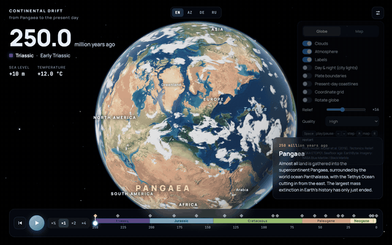

</div>

---

## ✨ Highlights

- **Real science, not keyframes.** Every one of 399 tectonic plates moves along its own Euler-pole path from the [Müller et al. (2019)](https://doi.org/10.1029/2018TC005462) global plate model, the same data GPlates uses. The motion is continuous at any time step.
- **Ends on the real Earth.** At 0 Ma nothing is rotated, so you see true present-day relief (Everest, the Mariana Trench), NASA Blue Marble colours, ice sheets, Arctic sea ice and, on the night side, city lights.
- **Oceans that are born and die.** Seafloor younger than the current age is removed using the global ocean-age grid, so the Atlantic visibly *unzips* through time. Mid-ocean ridges appear where they were, thanks to a lithospheric cooling model.
- **Growing and dying mountains.** The Himalayas rise after India hits Asia, the Alps and the Andes follow, and the Himalaya-scale Central Pangean Mountains erode away.
- **Changing climate.** Sea level floods the continents in the Cretaceous (hello, Western Interior Seaway). Red Triassic deserts give way to forests, Antarctica freezes at 34 Ma and Greenland at ~3 Ma.
- **Cinematic rendering.** Ray-marched Rayleigh/Mie atmosphere, procedural weather-like clouds with shadows, GGX sun glint on the ocean, relief shading, bloom and ACES tone mapping.
- **Globe and flat map.** Switch between an orbitable globe and an equirectangular map, with optional plate boundaries, present-day coastlines and a coordinate grid.
- **Four languages.** English, Azərbaycanca, Deutsch and Русский, switchable on the fly. The choice is remembered and shareable via `?lang=`.

## 🖼 Gallery

| | |
|:---:|:---:|
| 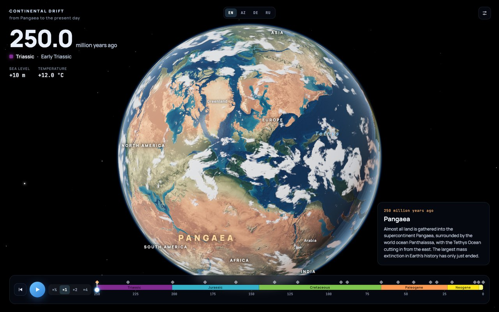 | 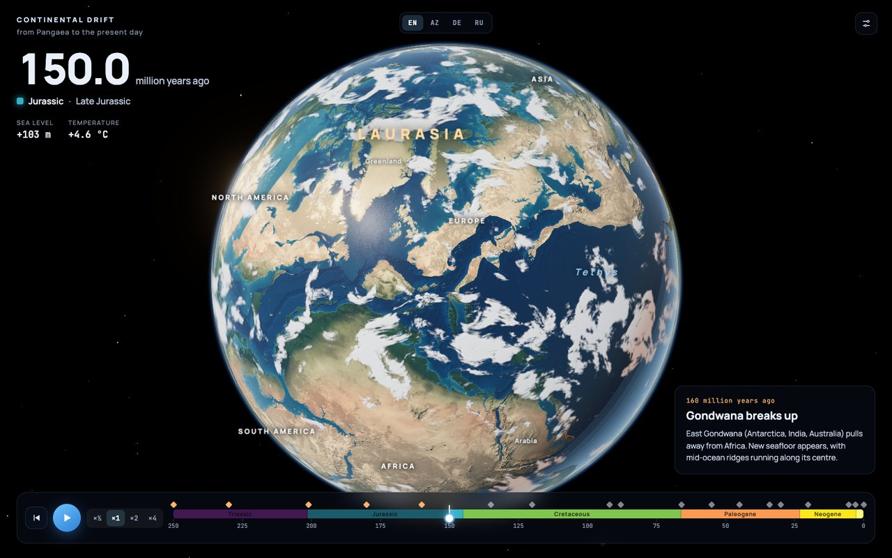 |
| **250 Ma.** Pangaea, red Triassic deserts, the Tethys | **150 Ma.** The Central Atlantic opens, Laurasia vs Gondwana |
| 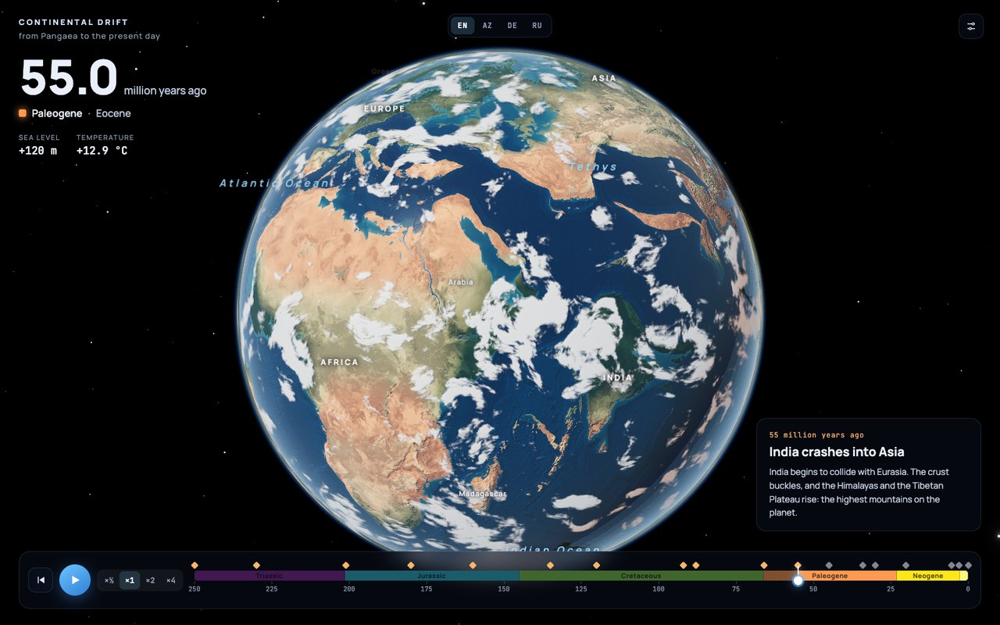 | 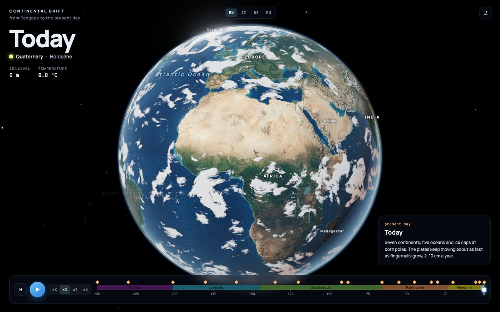 |
| **55 Ma.** India meets Asia; high Eocene seas | **Today.** The real Earth: relief, imagery, ice |
| 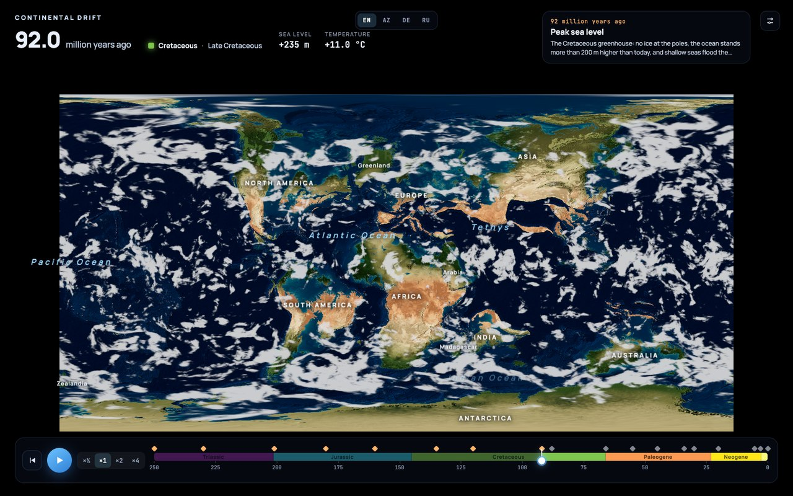 | 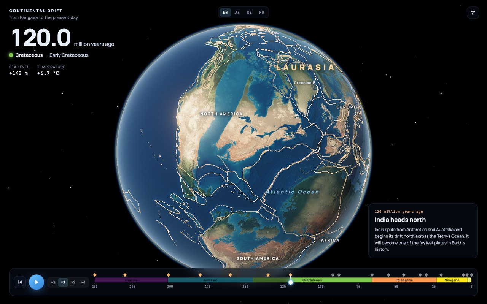 |
| **92 Ma, map view.** Sea level +235 m floods the continents | **Plate boundaries** from the Müller 2019 static polygons |
| 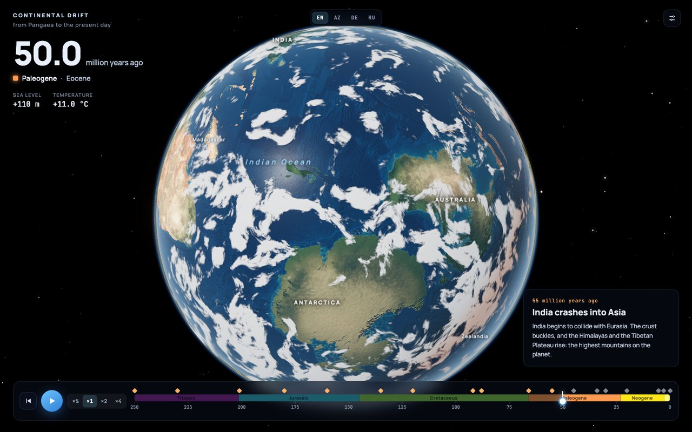 | 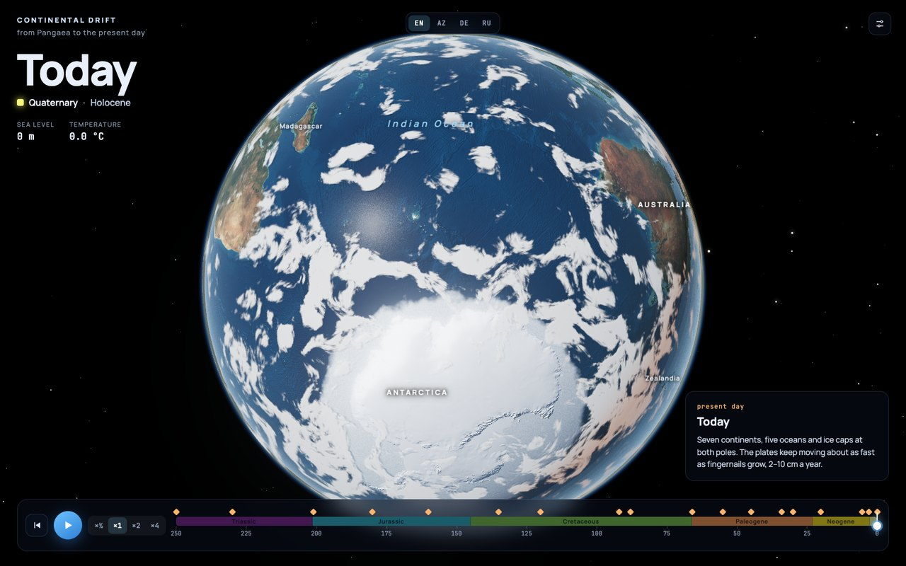 |
| **50 Ma.** Antarctica is still green and ice-free… | **…today** it is buried under an ice sheet |
| 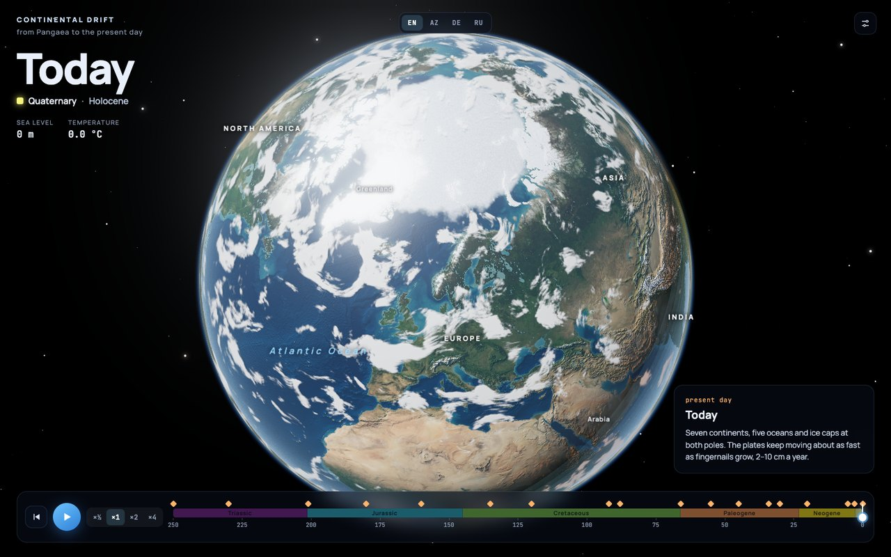 | 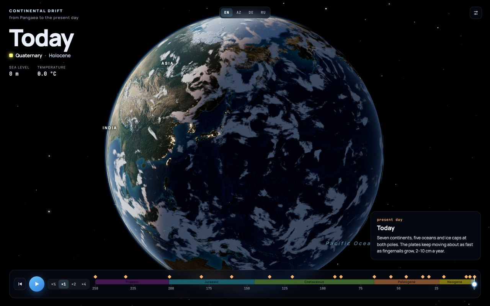 |
| **Arctic** sea ice and Greenland | **Day & night mode.** City lights appear only at the very end |

## 🚀 Getting started

```bash
git clone https://github.com/Elkhan-Isayev/pangaea-drift.git
cd pangaea-drift
npm install
npm run dev          # http://localhost:5173
```

```bash
npm run build        # production build into dist/
npm run preview      # serve the build locally
```

Every push to `main` is built and deployed to **GitHub Pages** by [`.github/workflows/deploy.yml`](.github/workflows/deploy.yml).

**Requirements:** a WebGL 2 browser (Chrome, Edge, Firefox, Safari 15+) and a discrete or Apple-silicon GPU for a smooth 60 fps. The *Quality* setting (Medium / High / Ultra) trades cube-map resolution and pixel ratio for speed. The app downloads about 50 MB of data on first load.

## 🎮 Controls

| Input | Action |
|---|---|
| <kbd>Space</kbd> | play / pause |
| <kbd>←</kbd> <kbd>→</kbd> (hold <kbd>Shift</kbd> for ×10) | step 1 million years |
| <kbd>M</kbd> | toggle globe ↔ flat map |
| <kbd>R</kbd> | restart from Pangaea |
| Drag / scroll | orbit and zoom (pan and zoom on the map) |
| Timeline | scrub through time; the ◆ markers jump to key events |
| `EN · AZ · DE · RU` | interface language (also `?lang=az` etc.) |

The settings panel toggles clouds, atmosphere, labels, day & night (city lights), plate boundaries, present-day coastlines, the coordinate grid and auto-rotation, and adjusts relief exaggeration and rendering quality.

## 🔬 How it works

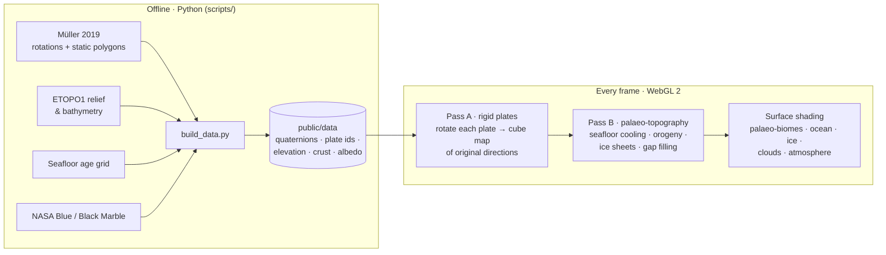

### 1. Plate reconstruction (GPU)
The present-day globe is tessellated **per plate**. A vertex shader rotates every vertex by its plate's absolute rotation at time *t* (quaternions precomputed every 0.5 Myr and interpolated). The result is rendered into a **cube map from the centre of the planet**; each texel stores the *present-day* direction of the crust that sits there at time *t*.

- Exact plate boundaries come from a per-fragment test against an 8192 × 4096 plate-id raster.
- Crust whose birth age (ocean-age grid, polygon valid-time) is younger than *t* is discarded.
- Overlaps are resolved in favour of continental and higher crust.

### 2. Palaeo-topography
A second cube pass turns those directions into elevation at time *t*:

- **Seafloor** was younger and hotter in the past, hence shallower. The subsidence accumulated since *t* is undone with the GDH1 plate-cooling model (Stein & Stein 1992):

  $$d(a)=\begin{cases}2600+365\sqrt{a}, & a<20\ \text{Myr}\\ 5651-2473\,e^{-0.0278\,a}, & a\ge 20\ \text{Myr}\end{cases}$$

  $$\text{uplift} = d(a_{\text{now}}) - d(a_{\text{now}}-t)$$

- **Young orogens** (Himalaya-Tibet, Alps, Andes, Cordillera, Zagros, …) are flattened before their onset age and rise progressively afterwards. Lowering the Great Plains lets the Cretaceous sea create the Western Interior Seaway.
- **Old orogens** (Appalachians, Mauritanides, Variscides, Urals, Cape Fold Belt) are restored to Himalayan heights with ridged noise and erode through the Mesozoic.
- **Ice sheets** grow following the glaciation history (Antarctica at the Eocene–Oligocene boundary, Greenland at ~3 Ma). Without ice, the bedrock is lower.
- **Subducted oceans** (Panthalassa, Tethys) have no present-day remnant; they are synthesised as abyssal plains blended with their reconstructed neighbours.

### 3. Environment & rendering
- Long-term **sea level** (after Haq 2018 / Miller et al. 2005) and **global temperature** (after Scotese et al. 2021) curves drive flooding, sea ice and climate belts.
- **Palaeo-biomes** come from palaeo-latitude, altitude, continentality (read from the mip chain of the land mask) and global warmth: Hadley-cell deserts, humid tropics, temperate forests, tundra. Over the last ~20 Myr they blend into real NASA imagery.
- **Clouds** are domain-warped fBm modulated by circulation belts (ITCZ, subtropical highs, storm tracks) and suppressed over hot continental interiors. They are baked into a cube map one face per frame.
- **Atmosphere** is a single-scattering ray marcher (Rayleigh + Mie) drawn additively over the globe, which also gives aerial perspective.

## 🗂 Project structure

```
pangaea-drift/
├── index.html                  # UI markup
├── src/
│   ├── main.js                 # app state, timeline, HUD, controls
│   ├── i18n.js                 # EN / AZ / DE / RU translations
│   ├── geo-timeline.js         # periods, epochs, events, sea-level & temperature curves
│   ├── reconstruction.js       # per-plate mesh, cube-map passes, CPU rotations
│   ├── scene.js                # renderer, globe, map, atmosphere, stars, post-processing
│   ├── clouds.js               # baked cloud cube map
│   ├── labels.js               # labels riding on plates + palaeo-ocean names
│   ├── data.js                 # asset loading with progress
│   └── shaders/                # GLSL: reconstruction, surface, clouds, atmosphere
├── scripts/                    # Python data pipeline
│   ├── build_data.py           # builds everything in public/data
│   ├── rotations.py            # GPlates .rot parser + finite-rotation maths
│   ├── regions.py              # hand-authored orogen regions
│   └── check_reconstruction.py # quick-look palaeo-maps for validation
├── public/data/                # prebuilt assets (~50 MB)
└── docs/                       # README media
```

## 🛠 Rebuilding the data

The prebuilt assets in `public/data/` are committed, so this is only needed to change the pipeline.

```bash
python3 -m venv .venv && .venv/bin/pip install numpy pillow scipy pyshp netCDF4
```

Then put the raw sources into `raw/` (not committed; `etopo.nc` alone is above GitHub's 100 MB file limit):

| File | Source |
|---|---|
| `raw/model/…_Tectonics_Updated/` | [Müller et al. 2019 plate model v2.0](https://www.earthbyte.org/webdav/ftp/Data_Collections/Muller_etal_2019_Tectonics/Muller_etal_2019_PlateMotionModel/) (unzipped) |
| `raw/agegrid.nc` | [Müller 2019 present-day age grid](https://www.earthbyte.org/webdav/ftp/Data_Collections/Muller_etal_2019_Tectonics/Muller_etal_2019_Agegrids/) |
| `raw/etopo.nc` | [ETOPO1 via NOAA ERDDAP](https://coastwatch.pfeg.noaa.gov/erddap/griddap/etopo180.html), 2′ stride |
| `raw/bm_june_21600.jpg` | [NASA Blue Marble NG, June 2004, 21600 px](https://visibleearth.nasa.gov/collection/1484/blue-marble) |
| `raw/black_marble.jpg` | [NASA Black Marble 2016](https://earthobservatory.nasa.gov/features/NightLights) |

```bash
npm run data                                             # regenerates public/data (~20 s)
.venv/bin/python scripts/check_reconstruction.py out/    # optional: palaeo-map sanity check
```

## ⚠️ Simplifications

This is a scientifically grounded visualisation, not a research tool.

- Plates move **rigidly**. The deforming networks of the model (rift margins, orogens) are approximated through elevation changes, so small gaps or overlaps can appear along plate edges.
- Orogen timing and regions, the palaeo-climate and the palaeo-biomes are simplified models, not reconstructions from specific studies.
- Clouds are plausible procedural weather, not historical data.

## 📚 Data & credits

| Data | Reference | License |
|---|---|---|
| Plate model, static polygons, ocean-age grid | Müller, R. D., et al. (2019). *A global plate model including lithospheric deformation along major rifts and orogens since the Triassic.* **Tectonics**, 38, 1884–1907. [doi:10.1029/2018TC005462](https://doi.org/10.1029/2018TC005462) | [CC BY 4.0](https://creativecommons.org/licenses/by/4.0/) (EarthByte) |
| ETOPO1 global relief | Amante, C. & Eakins, B. W. (2009). NOAA Technical Memorandum NESDIS NGDC-24. [doi:10.7289/V5C8276M](https://doi.org/10.7289/V5C8276M) | Public domain (NOAA) |
| Blue Marble Next Generation | Stöckli, R., et al. (2005). NASA Earth Observatory | NASA imagery, free to use with credit |
| Black Marble 2016 | NASA Earth Observatory / Suomi NPP VIIRS | NASA imagery, free to use with credit |
| Seafloor depth model | Stein, C. A. & Stein, S. (1992). *Nature*, 359, 123–129 | — |
| Sea-level curve | after Haq, B. U. (2018) and Miller, K. G., et al. (2005) | — |
| Temperature curve | after Scotese, C. R., et al. (2021). *Earth-Science Reviews*, 215 | — |

Rendering: [three.js](https://threejs.org) (MIT). Simplex noise: Ashima Arts / Stefan Gustavson (MIT). Fonts: Manrope, JetBrains Mono (OFL).

<div align="center">

Made with 🪐 by [Elkhan Isayev](https://github.com/Elkhan-Isayev)

</div>
